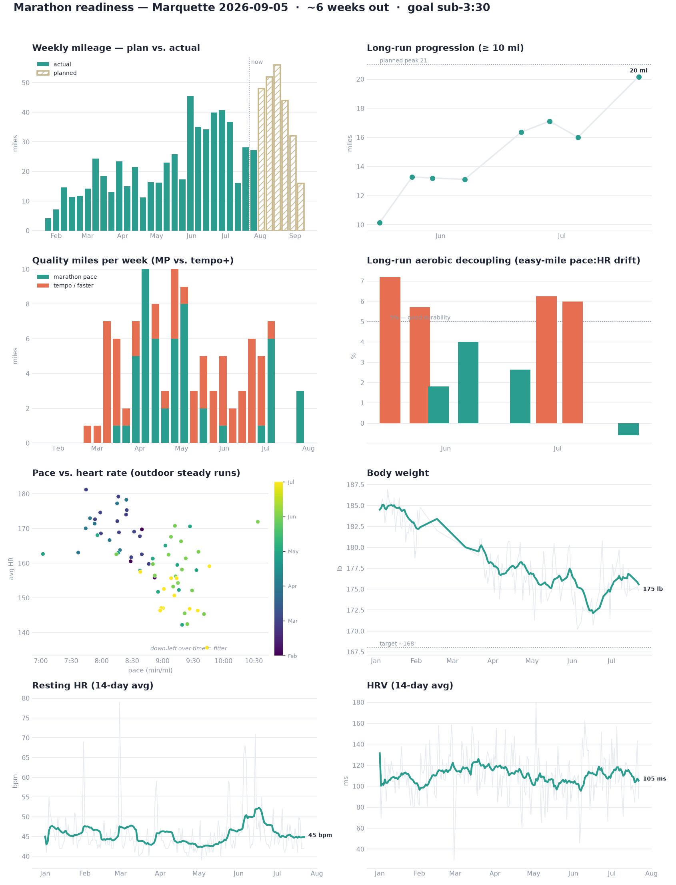

# Marathon Training — Marquette 2026

_Last updated: 2026-07-23 · source: Apple Health_

## Goal

- **Race:** Marquette, MI — Saturday 2026-09-05 (~6 weeks out)
- **Goal:** finish, sub-**3:30** (8:01/mi). Debut marathon — the point is completing it; time goal is next year.
- **MP work is trained at 7:45/mi** — faster than 3:30 race pace, so goal pace has built-in buffer.

## 2026 so far

- **Runs:** 115 (44 treadmill)
- **Total distance:** 591.7 mi
- **Longest run:** 20.2 mi on 2026-07-20 @ 9:08/mi
- **Quality miles:** 52 at marathon pace, 54 at tempo or faster

## Weekly progression

| Week ending | Runs | Miles | Longest | Avg pace | Avg HR | MP mi | Tempo mi |
|---|---:|---:|---:|---:|---:|---:|---:|
| 2026-01-25 | 2 | 4.1 | 2.1 | 9:40 | 173 | 0 | 0 |
| 2026-02-01 | 2 | 7.1 | 4.0 | 9:33 | 171 | 0 | 0 |
| 2026-02-08 | 4 | 14.5 | 4.1 | 9:05 | 163 | 0 | 0 |
| 2026-02-15 | 3 | 11.3 | 4.1 | 9:13 | 171 | 0 | 0 |
| 2026-02-22 | 3 | 11.7 | 4.1 | 8:43 | 165 | 0 | 1 |
| 2026-03-01 | 4 | 14.1 | 4.0 | 8:44 | 171 | 0 | 1 |
| 2026-03-08 | 5 | 24.3 | 6.2 | 8:27 | 167 | 0 | 7 |
| 2026-03-15 | 5 | 18.3 | 6.2 | 8:36 | 162 | 1 | 5 |
| 2026-03-22 | 4 | 13.0 | 4.1 | 8:24 | 169 | 1 | 1 |
| 2026-03-29 | 6 | 23.4 | 6.2 | 8:09 | 173 | 5 | 2 |
| 2026-04-05 | 4 | 15.0 | 4.1 | 7:54 | 173 | 10 | 0 |
| 2026-04-12 | 5 | 21.5 | 8.3 | 8:08 | 170 | 6 | 2 |
| 2026-04-19 | 3 | 11.1 | 4.1 | 8:07 | 175 | 2 | 1 |
| 2026-04-26 | 4 | 16.3 | 4.1 | 7:49 | 169 | 6 | 4 |
| 2026-05-03 | 4 | 16.3 | 5.1 | 8:08 | 166 | 8 | 1 |
| 2026-05-10 | 4 | 23.0 | 8.3 | 8:58 | 164 | 0 | 3 |
| 2026-05-17 | 5 | 25.9 | 10.1 | 8:51 | 161 | 2 | 3 |
| 2026-05-24 | 4 | 17.3 | 6.2 | 9:06 | 168 | 0 | 3 |
| 2026-05-31 | 6 | 45.4 | 13.3 | 8:54 | 157 | 1 | 4 |
| 2026-06-07 | 6 | 35.0 | 13.1 | 9:20 | 166 | 0 | 2 |
| 2026-06-14 | 6 | 34.2 | 8.9 | 9:11 | 158 | 0 | 3 |
| 2026-06-21 | 5 | 39.9 | 16.4 | 8:47 | 161 | 0 | 6 |
| 2026-06-28 | 5 | 40.7 | 17.1 | 9:02 | 154 | 1 | 4 |
| 2026-07-05 | 6 | 36.8 | 16.0 | 8:59 | 155 | 6 | 1 |
| 2026-07-12 | 3 | 16.1 | 6.2 | 9:33 | 149 | 0 | 0 |
| 2026-07-19 | 5 | 28.1 | 6.8 | 9:14 | 149 | 0 | 0 |
| 2026-07-26 | 2 | 27.2 | 20.2 | 9:15 | 151 | 3 | 0 |

## Long runs (≥ 10 mi)

| Date | Miles | Pace | Elev (ft) | MP miles | MP splits | Temp °F |
|---|---:|---:|---:|---:|---|---:|
| 2026-07-20 | 20.2 | 9:08 | 387 | 3 | 7:41, 7:41, 7:48 | 79 |
| 2026-07-05 | 16.0 | 9:01 | 841 | 3 | 7:53, 7:46, 7:46 | 71 |
| 2026-06-28 | 17.1 | 9:13 | 1200 | 1 | 7:51 | 65 |
| 2026-06-21 | 16.4 | 8:52 | 1155 | 0 | — | 54 |
| 2026-06-07 | 13.1 | 9:23 | 835 | 0 | — | 63 |
| 2026-05-30 | 13.2 | 8:38 | 382 | 1 | 7:35 | 59 |
| 2026-05-25 | 13.3 | 9:15 | 735 | 0 | — | 53 |
| 2026-05-17 | 10.1 | 9:16 | 323 | 0 | — | - |

## Treadmill / tempo sessions (last 8)

| Date | Miles | Avg pace | Fastest mile | Avg HR | Max HR |
|---|---:|---:|---:|---:|---:|
| 2026-07-17 | 6.8 | 9:26 | 9:13 | 149 | 164 |
| 2026-07-10 | 4.0 | 8:56 | 7:58 | 152 | 175 |
| 2026-07-02 | 5.0 | 8:45 | 7:51 | 165 | 189 |
| 2026-06-25 | 6.3 | 8:09 | 7:04 | 166 | 191 |
| 2026-06-17 | 5.0 | 8:16 | 6:53 | 170 | 197 |
| 2026-06-11 | 5.7 | 7:57 | 6:48 | 169 | 192 |
| 2026-06-09 | 3.0 | 9:18 | 9:14 | 145 | 152 |
| 2026-06-03 | 4.3 | 8:31 | 7:02 | 171 | 191 |

## Recovery & readiness

- **Sleep:** 5.2 h/night last 7d (28d avg 6.1 h) — deep 59 min, REM 109 min
- **Resting HR:** 44 bpm (7d) vs 45 (28d) — ↓ good
- **HRV:** 104 ms (7d) vs 111 (28d) — ↓ watch for fatigue
- **VO2Max:** 55.2 (2026-07-22)
- **HR recovery (1 min):** 44 bpm avg last 30d
- **Weight:** 176 lb (down from 184 in Jan, −7 lb) — lighter = free pace; trending toward ~168 target

## Race-day outlook (honest read)

- **On track for sub-3:30, with margin.** The 20-miler is banked, 4 runs of 16+ mi, VO2Max 55, and MP work at 7:45/mi — 15s/mi faster than 8:01 goal pace, so the target has cushion.
- **But that MP pace isn't 'free' yet:** those miles run at ~171 bpm (threshold, not aerobic MP) — so 7:45 for a full 26.2 is unproven. Sub-3:30 at ~8:00/mi sits at an easier effort and is the realistic play.
- **Watch items:** volume is moderate (30–45 mpw — right-sized for this goal, not faster); fueling is untested at race distance; sleep ~6 h is the weak spot; HRV has drifted down slightly off the June peak. None are red flags for finishing.
- **Bottom line:** for a debut where the goal is to finish strong, the data says you're in good shape and ahead of where sub-3:30 requires.

## Recent runs

| Date | Miles | Pace | Avg HR | Power | Elev (ft) | Where |
|---|---:|---:|---:|---:|---:|---|
| 2026-07-22 | 7.0 | 9:35 | 146 | 232W | 218 | outdoor |
| 2026-07-20 | 20.2 | 9:08 | 156 | 235W | 387 | outdoor |
| 2026-07-18 | 5.0 | 9:14 | 156 | 239W | 170 | outdoor |
| 2026-07-17 | 6.8 | 9:26 | 149 | - | 0 | treadmill |
| 2026-07-15 | 6.1 | 9:27 | 147 | 238W | 326 | outdoor |
| 2026-07-14 | 4.1 | 8:58 | 146 | 247W | 80 | outdoor |
| 2026-07-13 | 6.1 | 8:59 | 147 | 249W | 130 | outdoor |
| 2026-07-10 | 4.0 | 8:56 | 152 | - | 0 | treadmill |
| 2026-07-09 | 5.9 | 9:46 | 159 | 230W | 524 | outdoor |
| 2026-07-07 | 6.2 | 9:44 | 136 | 231W | 266 | outdoor |
| 2026-07-05 | 16.0 | 9:01 | 153 | 247W | 841 | outdoor |
| 2026-07-04 | 3.3 | 9:12 | 151 | 243W | 226 | outdoor |
